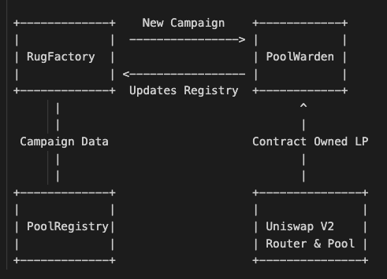

# rugPool

Crowdfund, Fair-Launch, and Build LP for Meme Tokens.

## OVERVIEW

- `RugFactory`: Permissionless factory for creating `PoolWarden` contracts.
- `PoolWarden`: ERC20 Contracts representing specific campaigns, capable of building Contract owned Univ2 LP tokens via SupSwap.
- `PoolRegistry`: Registry for all `PoolWarden` contracts, tracking campaign and liquidity pool information.

Basic structure and interactions between our project contracts:

- **Campaign Creation**: The `RugFactory` contract creates new `PoolWarden` contracts, each representing a unique Token Launch
  
- **Registry Tracking**: The `PoolRegistry` keeps track of all `PoolWarden` campaigns

- **Liquidity Pooling**: Each `PoolWarden` can manage contributions and, post-distribution, interact with Uniswap V2 to create or add to liquidity pools.

## Development Highlights

- Utilization of OpenZeppelin's `Ownable` contract for access control, ensuring that only authorized entities can perform critical functions.
- Integration with Uniswap V2's interfaces for seamless interaction with decentralized exchange functionalities.
- Emphasis on transparency and traceability through comprehensive event logging.

## Future Directions

- Expand `PoolRegistry` functionalities to include dynamic tracking of participant contributions and campaign milestones.
- Integrate with off-chain analytics platforms for enhanced data analysis and visualization capabilities.
- Explore upgradability options for smart contracts to ensure long-term adaptability and improvement.

## TODO

- Sequencer Fee Sharing | Structure
- RugPool.sol | Moonbased Rover Structure for FACTORY
